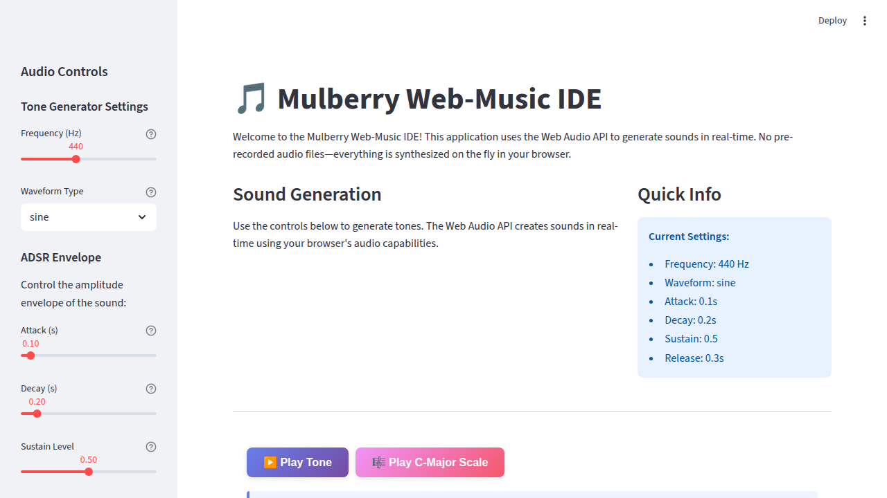

# Mulberry Web-Music IDE 🎵

A browser-based music interaction environment built with Streamlit and Web Audio API for real-time sound synthesis.

## Features

- **Real-time tone generation** using Web Audio API oscillator nodes
- **ADSR envelope control** (Attack, Decay, Sustain, Release) for shaping sound
- **Multiple waveform types**: sine, square, sawtooth, triangle
- **Interactive controls**: frequency slider, waveform selector
- **C-Major scale demo** to demonstrate musical sequencing
- **Educational comments** explaining Web Audio API concepts for learners

## Installation

1. Clone the repository:
```bash
git clone https://github.com/djmahe4/Mulberry.git
cd Mulberry
```

2. Install dependencies:
```bash
pip install -r requirements.txt
```

## Usage

Run the Streamlit application:
```bash
streamlit run mulberry_audio.py
```

The application will open in your default web browser at `http://localhost:8501`.

## Screenshot


## How It Works

### Audio Architecture

The application follows this audio processing chain:

```
Browser → Streamlit UI → Web Audio JS → AudioContext → Oscillator → Gain → Speakers
```

### Key Components

1. **AudioContext**: The browser's audio processing engine that manages all sound generation
2. **OscillatorNode**: Generates raw waveforms at specific frequencies
3. **GainNode**: Controls volume and implements ADSR envelopes
4. **Audio Graph**: Nodes are connected to form a processing pipeline

### ADSR Envelope

The ADSR envelope shapes how the sound evolves over time:

- **Attack**: Time for sound to reach full volume
- **Decay**: Time for sound to drop to sustain level
- **Sustain**: Volume level maintained while note is held
- **Release**: Time for sound to fade to silence after note ends

## Controls

### Sidebar Controls

- **Frequency Slider** (200-800 Hz): Adjust the pitch of the generated tone
- **Waveform Selector**: Choose between sine, square, sawtooth, or triangle waves
- **Attack** (0.01-2.0s): Control the attack phase of the envelope
- **Decay** (0.01-2.0s): Control the decay phase of the envelope
- **Sustain** (0.0-1.0): Set the sustain level
- **Release** (0.01-3.0s): Control the release phase of the envelope

### Action Buttons

- **Play Tone**: Generate a single tone with your current settings
- **Play C-Major Scale**: Play a C-Major scale (C, D, E, F, G, A, B, C) as a demo

## Technical Details

- **No pre-rendered audio**: All sounds are generated in real-time
- **Browser-based**: Runs entirely in the browser using Web Audio API
- **Audio unlock**: Respects browser autoplay policies (requires user gesture)
- **Precise timing**: Uses AudioContext's high-precision clock for scheduling

## Learning Resources

The code includes extensive comments explaining:
- How Web Audio API works
- Audio graph node connections
- ADSR envelope implementation
- Musical note frequency calculations
- Best practices for Web Audio programming

## Browser Compatibility

This application works in modern browsers that support:
- Web Audio API
- ES6 JavaScript
- HTML5

Tested on: Chrome, Firefox, Safari, Edge

## License

See LICENSE file for details.
